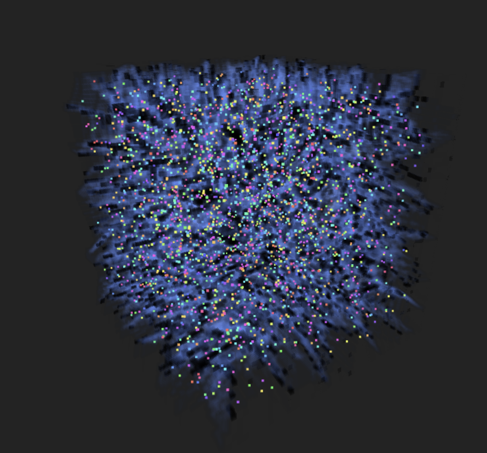

# 3D Jump Flooding Algorithm Voronoi Visualization

An interactive WebGL visualization of 3D Voronoi diagrams using the Jump Flooding Algorithm (JFA) with a 2D atlas approach for efficient GPU computation.


## 🚀 Live Demo

[View Live Demo](https://virtualorganics.github.io/JFA-3D-Voronoi-Atlas/)

## 📸 Screenshots


*Beautiful 3D Voronoi cells with customizable colors and edge detection*


*Glass transparency mode showing internal cell structure*


*Single color mode with cyan edges creating a unified aesthetic*



*Three-tier system: transparent cell volumes, semi-transparent faces, and opaque edges*

## 📋 Features

### Core Functionality
- **3D Jump Flooding Algorithm**: Efficient GPU-based computation of 3D Voronoi diagrams
- **2D Atlas Approach**: Stores 3D volume data in a 2D texture for WebGL compatibility
- **Real-time Ray Marching**: Volume rendering with customizable opacity and transparency modes
- **Dynamic Point Animation**: Animate seed points with physics-based movement

### Visual Controls
- **Number of Points**: 1-10,000 seed points
- **Volume Resolution**: 32³, 64³, 128³, 256³ voxels
- **Transparency Modes**:
  - Foggy: Traditional volume rendering
  - Glass: True transparency with proper alpha blending
- **Color Modes**:
  - Random Hue: Each cell gets a unique color
  - Single Color: All cells use the same color
- **Three-Tier Visual System**:
  - Cell Volume: Interior of each Voronoi cell
  - Cell Face: Boundaries between two cells
  - Cell Edge: Lines where three or more cells meet
- **Independent Controls for Each Tier**:
  - Cell Volume: Color and transparency control
  - Cell Face: Separate color and transparency (cyan by default)
  - Cell Edge: Separate color and transparency (white by default)
- **Edge Detection**: Smooth or sharp cell boundaries with adjustable thickness
- **Volume Slicing**: Cut through the volume along X, Y, or Z axes

### UI Features
- **Hide/Show Panel**: Toggle control panel visibility
- **Pause/Resume**: Stop rendering to save resources
- **Point Visualization**: Show/hide seed points with adjustable size
- **Lighting Control**: Toggle ambient and directional lights
- **Wireframe Display**: Show/hide bounding box

## 🎮 Controls

### Mouse
- **Left Click + Drag**: Rotate view
- **Right Click + Drag**: Pan camera
- **Scroll**: Zoom in/out

### Keyboard
- **H**: Toggle control panel (coming soon)

## 🛠️ Technical Details

### Algorithm Overview


### Implementation Details

1. **2D Atlas Storage**: The 3D volume is stored as a 2D texture atlas where each Z-slice is laid out in a grid
2. **JFA Passes**: Log₂(volume_size) passes with decreasing step sizes
3. **Ray Marching**: Front-to-back compositing through the volume
4. **Edge Detection**: Samples neighboring voxels to detect cell boundaries

### Performance Considerations

- **32³ volume**: Smooth on most devices
- **64³ volume**: Default, good balance of quality and performance
- **128³ volume**: High quality, requires decent GPU
- **256³ volume**: Very high quality, requires powerful GPU and high VRAM

## 🚦 Getting Started

### Prerequisites
- Modern web browser with WebGL 2.0 support
- Good GPU recommended for higher resolutions

### Running Locally

1. Clone the repository:
```bash
git clone https://github.com/your-username/3d-jfa-voronoi.git
cd 3d-jfa-voronoi
```

2. Start a local web server:
```bash
# Using Python
python -m http.server 8000

# Using Node.js
npx http-server -p 8000
```

3. Open in browser:
```
http://localhost:8000
```

## 🎨 Best Settings

### For Glass Effect
- Transparency Mode: Glass
- Overall Transparency: 0.3-0.5
- Ray Step Opacity: 0.01-0.02
- Cell Volume Transparency: 0.2-0.4
- Cell Face Transparency: 0.6-0.8
- Cell Edge Transparency: 0.9-1.0
- Edge Color: White
- Face Color: Cyan
- Show Lighting: Off

### For Wireframe Effect
- Cell Volume Transparency: 0.0-0.1 (nearly invisible)
- Cell Face Transparency: 0.5 (semi-visible)
- Cell Edge Transparency: 1.0 (fully opaque)
- Edge Color: White or bright color
- Face Color: Cyan or complementary color
- Show Lighting: Off

### For X-Ray Effect
- Cell Volume Transparency: 0.3
- Cell Face Transparency: 0.6
- Cell Edge Transparency: 1.0
- All three tiers visible with increasing opacity

### For Performance
- Volume Resolution: 64³ or lower
- Number of Points: < 100
- Animate Points: Off
- Pause when not viewing

### For Quality
- Volume Resolution: 128³ or 256³
- Edge Smoothness: 2.0-3.0
- Ray Step Opacity: 0.02-0.04

## 📝 Technical Notes

### Browser Compatibility
- Chrome: ✅ Full support
- Firefox: ✅ Full support
- Safari: ✅ Full support (macOS 10.15+)
- Edge: ✅ Full support

### GPU Requirements
- WebGL 2.0 support required
- Recommended: 2GB+ VRAM for 256³ resolution
- Mobile devices: Use 32³ or 64³ resolution

## 🔧 Troubleshooting

### Performance Issues
1. Lower the volume resolution
2. Reduce the number of points
3. Turn off point animation
4. Use the Pause button when not actively viewing

### Visual Artifacts
1. Adjust Ray Step Opacity (lower = smoother)
2. Increase Edge Smoothness
3. Try different transparency modes

### Crashes on Regenerate
1. Use the Pause button before regenerating
2. Lower resolution before increasing
3. Refresh the page if issues persist

## 📄 License

This project is licensed under the MIT License - see the [LICENSE](LICENSE) file for details.

## 🤝 Contributing

Contributions are welcome! Please feel free to submit a Pull Request.

## 🙏 Acknowledgments

- Three.js team for the excellent 3D library
- GPU Computation Renderer implementation
- Jump Flooding Algorithm research papers

## 📚 References

- [Jump Flooding Algorithm](https://www.comp.nus.edu.sg/~tants/jfa.html)
- [Three.js Documentation](https://threejs.org/docs/)
- [WebGL Volume Rendering](https://www.willusher.io/webgl/2019/01/13/volume-rendering-with-webgl) 